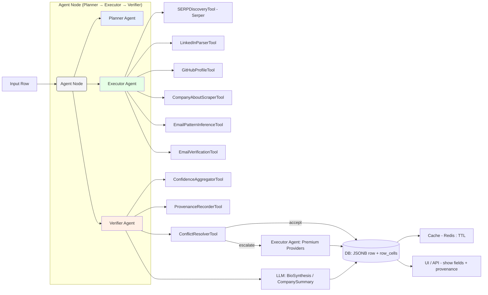
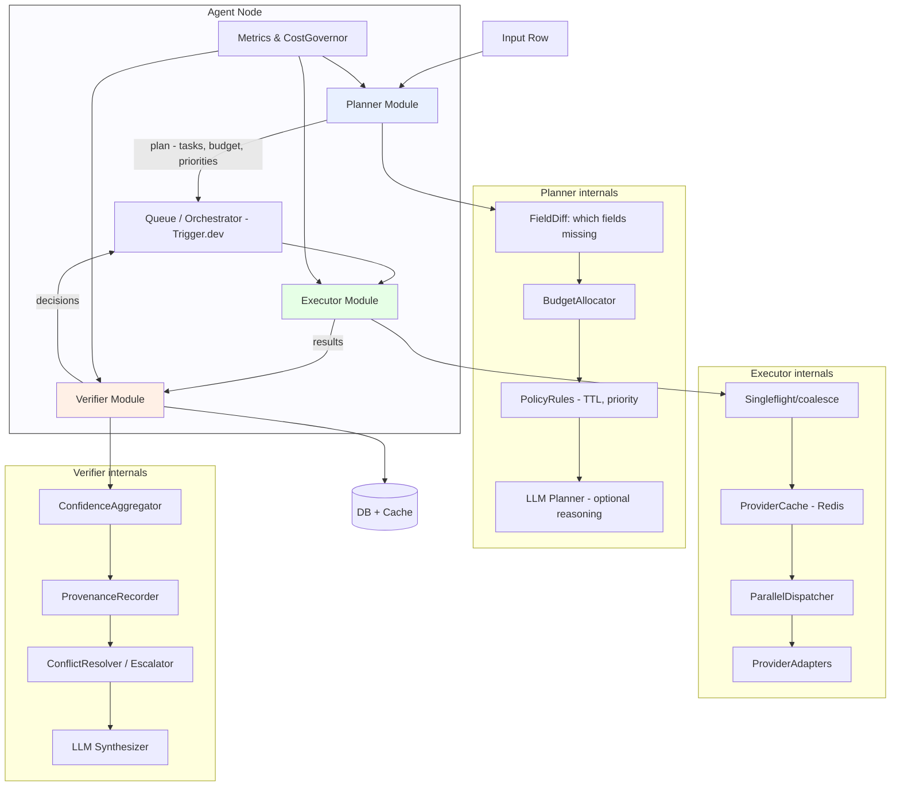
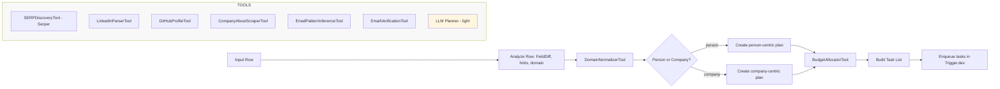
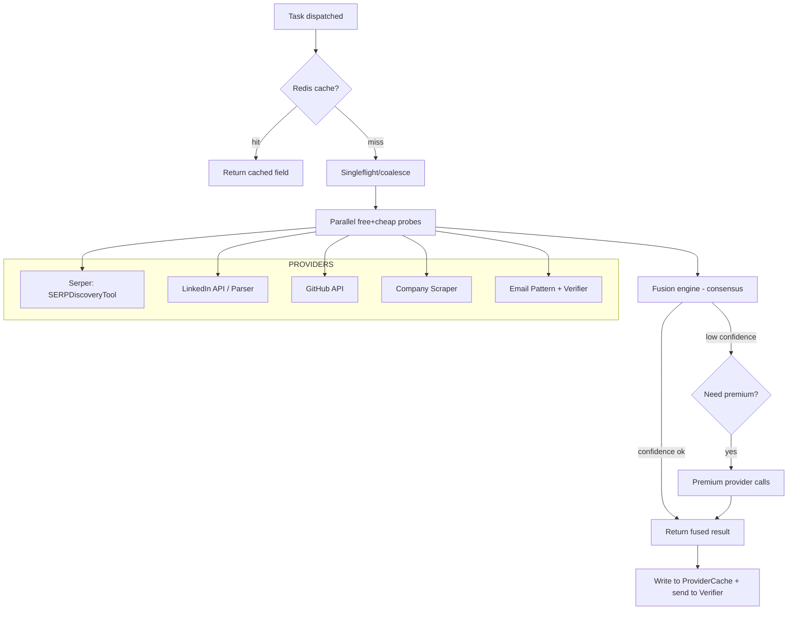
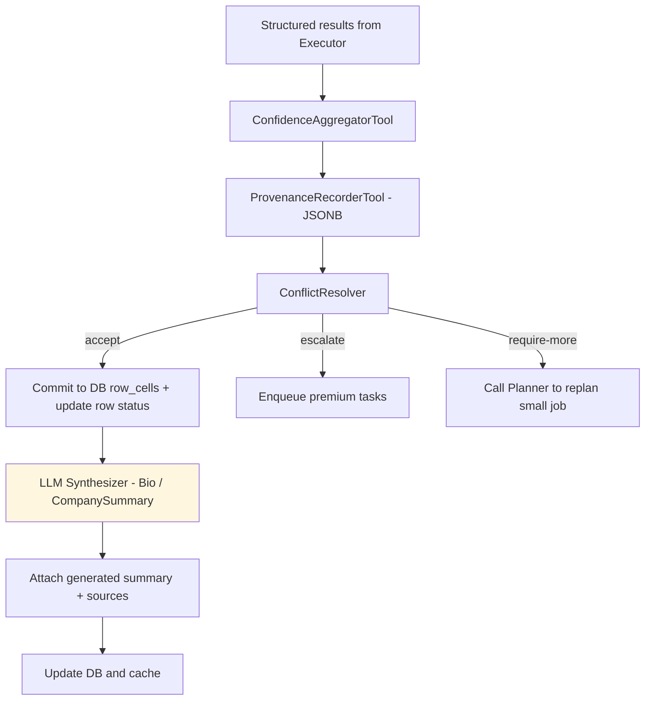

# Production-Grade Agentic Enrichment System

Transform the current mock-based enrichment system into a production-ready agentic pipeline that follows the principle: **Discover facts first → verify → normalize → only then let LLM summarize**.

The codebase already has solid infrastructure (Trigger.dev workflows, Redis caching, circuit breakers, multi-agent scaffolding). The plan focuses on replacing mock providers with real implementations and implementing the 4-phase agentic architecture.

---

## Phase 1: Data Model & Core Infrastructure (Week 1)

### Step 1: Finalize FieldValue Schema
- Add `FieldValue<T>` type to `packages/types/src/enrichment.ts` with `value`, `confidence`, `sources[]`, `verified`, `raw`, `timestamp`, `ttlDays`
- Update Prisma schema in `apps/api/prisma/schema.prisma` to store JSONB with this structure in `Row.data` and `CellEnrichmentTask.result`

```typescript
type FieldValue<T> = {
  value: T | null
  confidence: number          // 0–1
  sources: string[]           // ["linkedin", "github", "serper"]
  verified?: boolean          // only for email
  raw?: any                   // provider raw snippet
  timestamp: ISOString
  ttlDays: number
}
```

### Step 2: Implement Identity Resolution Tools
- Create `apps/workflows/src/tools/identity-resolver.ts` — determines entity type (person vs company), extracts canonical identifiers
- Create `apps/workflows/src/tools/domain-normalizer.ts` — normalizes company domains, handles redirects, extracts root domain

### Step 3: Implement Provenance Recording
- Create `apps/workflows/src/tools/provenance-recorder.ts` — records source attribution for every field value
- Add `ProvenanceLog` model to Prisma schema for audit trail

---

## Phase 2: Deterministic Enrichment Tools (Week 1-2)

### Step 4: Implement Real SERP Discovery Tool
- Create `apps/workflows/src/providers/serper-provider.ts` using existing Serper integration at `apps/workflows/src/serper-test.ts`
- Query patterns: `"Full Name" LinkedIn`, `"Name" "Company"`, `"Company" About`
- Return URLs + snippets with source attribution

### Step 5: Implement LinkedIn Parser Tool  
- Enhance `apps/workflows/src/services/linkedin-api.ts` to use real RapidAPI LinkedIn Data API
- Extract: name, title, company, location, social links
- Set `confidence: 0.9` for verified LinkedIn data

### Step 6: Implement Company About Scraper Tool
- Create `apps/workflows/src/tools/company-scraper.ts` using Playwright/Puppeteer
- Extract company name, description, social links from domain homepages
- Set `confidence: 0.7` for scraped data

### Step 7: Implement GitHub Profile Tool
- Create `apps/workflows/src/providers/github-provider.ts`
- Extract name, bio, location, company from GitHub profiles
- Set `confidence: 0.8` for verified GitHub data

---

## Phase 3: Email Verification Pipeline (Week 2)

### Step 8: Implement Email Pattern Inference Tool
- Create `apps/workflows/src/tools/email-pattern-inference.ts`
- Generate candidates: `first@domain`, `first.last@domain`, `flast@domain`, etc.
- Return array of `EmailCandidate` with `confidence: 0.3` (unverified)

### Step 9: Implement Email Verification Tool
- Create `apps/workflows/src/tools/email-verifier.ts`
- Integrate real SMTP ping or ZeroBounce/Hunter API
- Mark `verified: true/false`, upgrade confidence to `0.95` if verified

### Step 10: Update Frontend for Email Candidates
- Modify `apps/web/app/(dashboard)/tables/[tableId]/page.tsx` to show email candidates list with verification status
- Never show single email unless verified

---

## Phase 4: Agentic Control Loop (Week 2-3)

### Step 11: Implement Planner Agent
- Enhance `apps/workflows/src/agents/concierge.ts` with field-diff analysis, budget allocation, and task prioritization
- Create `apps/workflows/src/agents/planner.ts` with `BudgetAllocatorTool` and `PolicyRules`

### Step 12: Implement Executor Agent
- Enhance `apps/workflows/src/optimized/entity-enrichment.ts` to use parallel dispatching with singleflight
- Wire all real providers: Serper → LinkedIn → GitHub → CompanyScraper → Email

### Step 13: Implement Verifier Agent
- Create `apps/workflows/src/agents/verifier.ts`
- Integrate `ConfidenceAggregatorTool`, `ConflictResolverTool`
- Decide: accept / escalate to premium / require-more-data

### Step 14: Implement Confidence Aggregator
- Create `apps/workflows/src/tools/confidence-aggregator.ts`
- Multi-source consensus logic: if sources ≥ 2 agree, boost confidence
- Conflict detection and resolution

---

## Phase 5: LLM Synthesis (Week 3)

### Step 15: Implement Bio Synthesis Tool
- Create `apps/workflows/src/tools/bio-synthesizer.ts`
- Input: scraped snippets, LinkedIn text, GitHub bio
- Output: 1-2 line bio with mandatory `sources[]` and `label: "generated"`

### Step 16: Implement Company Summary Tool
- Create `apps/workflows/src/tools/company-summarizer.ts`
- Same pattern: synthesize from verified sources only
- If sources < 2, downgrade confidence and note in summary

---

## Phase 6: Integration & Observability (Week 3)

### Step 17: Wire Complete Workflow
- Update `apps/workflows/src/tasks/index.ts` to orchestrate: Planner → Executor → Verifier → LLM Synthesis
- Toggle `enrichmentConfig.useMockProviders = false` in `apps/workflows/src/enrichment-config.ts`

### Step 18: Add Cost Governor
- Create `apps/workflows/src/services/cost-governor.ts`
- Track per-user/team budget, throttle expensive providers

### Step 19: Implement Provider Health Dashboard
- Create `apps/web/app/(dashboard)/admin/providers/page.tsx`
- Show circuit breaker status, success rates, costs

---

## Architecture Diagrams

### Full Enrichment Pipeline (High-Level)



### Agent Node — Internal Architecture



### Planner Agent (Detailed Flow)



### Executor Agent (Detailed Flow)



### Verifier Agent (Detailed Flow)



---

## Task List (Prioritized)

### Week 1 - Foundation
- [ ] Step 1: Define `FieldValue<T>` type and update Prisma schema
- [ ] Step 2: Build `IdentityResolverTool` and `DomainNormalizerTool`
- [ ] Step 3: Build `ProvenanceRecorderTool`
- [ ] Step 4: Implement real `SERPDiscoveryTool` using Serper API
- [ ] Step 5: Implement `LinkedInParserTool` using RapidAPI

### Week 2 - Enrichment Providers + Email
- [ ] Step 6: Implement `CompanyAboutScraperTool`
- [ ] Step 7: Implement `GitHubProfileTool`
- [ ] Step 8: Build `EmailPatternInferenceTool`
- [ ] Step 9: Build `EmailVerificationTool` (integrate Hunter/ZeroBounce)
- [ ] Step 10: Update frontend to show email candidates

### Week 3 - Agentic Loop + LLM
- [ ] Step 11: Implement `PlannerAgent` with budget allocation
- [ ] Step 12: Enhance `ExecutorAgent` with parallel dispatching
- [ ] Step 13: Implement `VerifierAgent` with conflict resolution
- [ ] Step 14: Build `ConfidenceAggregatorTool`
- [ ] Step 15: Build `BioSynthesisTool` (LLM)
- [ ] Step 16: Build `CompanySummaryTool` (LLM)
- [ ] Step 17: Wire complete workflow orchestration
- [ ] Step 18: Add `CostGovernor` service
- [ ] Step 19: Build Provider Health Dashboard

---

## Provider Recommendations

| Provider Type | MVP Choice | Scale Choice | Cost |
|---------------|------------|--------------|------|
| LinkedIn Data | RapidAPI LinkedIn Data API | Proxycurl | ~$0.03/request |
| Email Verification | Hunter.io | ZeroBounce | ~$0.01/verify |
| SERP Search | Serper.dev | SerpAPI | ~$0.01/search |
| LLM Synthesis | Groq (llama-3.3-70b) | GPT-4 Turbo | Variable |

---

## Environment Variables Needed

```bash
# Database
DATABASE_URL=postgresql://...

# LinkedIn (RapidAPI)
RAPIDAPI_KEY=...
RAPIDAPI_LINKEDIN_HOST=linkedin-data-api.p.rapidapi.com

# Search
SERPER_API_KEY=...

# Email Verification
HUNTER_API_KEY=...

# AI (for agents)
GROQ_API_KEY=...

# Caching
REDIS_URL=redis://...
```

---

## Key Principles (Reference)

1. **Discover facts first** → verify → normalize → only then let LLM summarize
2. **LLMs are synthesizers, not discoverers** — never trust LLM outputs without sources
3. **Every field must return `FieldValue<T>`** — no exceptions
4. **Email is risky** — never show single email unless verified
5. **Confidence scores must be earned** — sources < 2 = downgrade confidence
