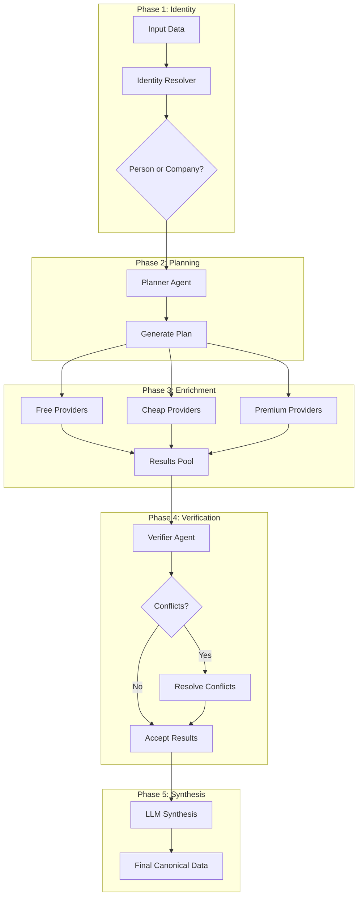

# Agentic Enrichment System

A production-grade multi-agent enrichment pipeline that follows the principle:

> **Discover facts first → verify → normalize → only then let LLM summarize**

## Overview

This system replaces mock providers with real API integrations and implements a sophisticated 5-phase enrichment pipeline:



## Architecture

### Providers (Deterministic Enrichment)

| Provider | Tier | Cost | Fields |
|----------|------|------|--------|
| GitHub API | Free | $0 | name, location, company, email, socialLinks |
| Company Scraper | Free | $0 | company, description, socialLinks |
| Serper.dev | Cheap | ~$0.01 | name, company, linkedinUrl, domain |
| LinkedIn API | Premium | ~$0.02-0.05 | name, company, title, email, location, linkedinUrl |

### Tools

| Tool | Purpose |
|------|---------|
| IdentityResolver | Detects entity type (person vs company) |
| DomainNormalizer | Normalizes domains, strips subdomains |
| ProvenanceRecorder | Tracks source of each value |
| ConfidenceAggregator | Merges multi-source results |
| EmailPatternInference | Generates email candidates |
| EmailVerifier | Verifies emails via Hunter/ZeroBounce |

### Agents

| Agent | Purpose |
|-------|---------|
| PlannerAgent | Generates enrichment plan, allocates budget |
| VerifierAgent | Resolves conflicts, validates results |

### LLM Synthesizers

| Synthesizer | Purpose |
|-------------|---------|
| BioSynthesizer | Generates short bio from enriched data |
| CompanySummarizer | Generates company summary |

## Usage

### Basic Enrichment

```typescript
import { agenticEnrichmentTask } from "./tasks/agentic-enrichment";

// Trigger enrichment for a single row
const result = await agenticEnrichmentTask.trigger({
    tableId: "table_xxx",
    rowId: "row_xxx",
    fieldsToEnrich: ["email", "company", "linkedinUrl", "shortBio"],
    budgetCents: 100, // $1 budget
    mode: "normal",
});
```

### Batch Enrichment

```typescript
import { batchAgenticEnrichmentTask } from "./tasks/agentic-enrichment";

// Trigger batch enrichment
const result = await batchAgenticEnrichmentTask.trigger({
    tableId: "table_xxx",
    rowIds: ["row_1", "row_2", "row_3"],
    fieldsToEnrich: ["email", "company"],
    budgetCentsPerRow: 50,
});
```

### Direct Provider Usage

```typescript
import { linkedInProvider, serperProvider } from "./tools/providers";

// Use LinkedIn provider directly
const result = await linkedInProvider.enrich(input, "linkedinUrl");

// Use Serper for discovery
const searchResult = await serperProvider.enrich(input, "linkedinUrl");
```

## Configuration

### Environment Variables

```bash
# Required
GROQ_API_KEY=gsk_xxxxx           # LLM synthesis
SERPER_API_KEY=xxxxx             # SERP discovery
RAPIDAPI_KEY=xxxxx               # LinkedIn API

# Optional
GITHUB_TOKEN=ghp_xxxxx           # Higher rate limits
HUNTER_API_KEY=xxxxx             # Email verification
ZEROBOUNCE_API_KEY=xxxxx         # Alternative email verification
```

### enrichment-config.ts

```typescript
export const enrichmentConfig = {
    // Toggle between mock and real providers
    useMockProviders: false,
    
    // Budget controls
    maxCostPerCellCents: 50,
    defaultBudgetCentsPerRow: 100,
    
    // Provider enablement
    enableWebsiteScraper: true,
    enableSearch: true,
    enableLinkedIn: true,
    enableAIAgent: true,
    enableGitHub: true,
    enableEmailVerifier: true,
    
    // Agentic mode
    enableAgenticMode: true,
    agenticConfig: {
        maxIterations: 3,
        escalationThreshold: 0.3,
        synthesisMinSources: 2,
    },
};
```

## File Structure

```
apps/workflows/src/
├── tasks/
│   └── agentic-enrichment.ts    # Main orchestration workflow
├── agents/
│   ├── planner.ts               # Budget allocation & planning
│   ├── verifier.ts              # Conflict resolution
│   └── index.ts
├── tools/
│   ├── identity-resolver.ts     # Entity type detection
│   ├── domain-normalizer.ts     # Domain normalization
│   ├── provenance-recorder.ts   # Source tracking
│   ├── confidence-aggregator.ts # Result merging
│   ├── email-pattern-inference.ts
│   ├── email-verifier.ts
│   ├── bio-synthesizer.ts       # LLM bio generation
│   ├── company-summarizer.ts    # LLM company summary
│   ├── providers/
│   │   ├── serper-provider.ts   # SERP discovery
│   │   ├── linkedin-provider.ts # LinkedIn API
│   │   ├── github-provider.ts   # GitHub API
│   │   ├── company-scraper.ts   # Website scraping
│   │   └── index.ts
│   └── index.ts
├── services/
│   └── cost-governor.ts         # Budget tracking
└── types/
    └── enrichment.ts            # Type definitions
```

## Data Flow

### Input → Canonical Output

```
Raw Input:
  { name: "John Doe", company: "Acme Inc" }

↓ Identity Resolution
  { entityType: "person", canonicalName: "John Doe", domain: "acme.com" }

↓ Provider Results (multiple sources)
  [
    { field: "email", value: "john@acme.com", confidence: 0.3, source: "pattern" },
    { field: "email", value: "john.doe@acme.com", confidence: 0.95, source: "linkedin" },
    { field: "linkedinUrl", value: "linkedin.com/in/johndoe", confidence: 0.9 }
  ]

↓ Verification & Aggregation
  { email: "john.doe@acme.com", confidence: 0.95 }  // Higher confidence wins

↓ LLM Synthesis
  { shortBio: "John Doe is a software engineer at Acme Inc..." }

↓ Final Canonical Data
  {
    email: { value: "john.doe@acme.com", confidence: 0.95, verified: true },
    linkedinUrl: { value: "...", confidence: 0.9 },
    shortBio: { value: "...", confidence: 0.7, label: "generated" }
  }
```

## Cost Management

The CostGovernor service tracks:
- Per-row budget limits
- Provider-specific limits
- Total budget consumption
- Provider disabling when limits are reached

```typescript
import { createCostGovernor } from "./services/cost-governor";

const governor = createCostGovernor({
    totalCents: 10000,      // $100 total budget
    perRowLimitCents: 100,  // $1 per row max
    warningThreshold: 0.8,  // Warn at 80%
    providerLimits: {
        linkedin_api: 3000,  // $30 max for LinkedIn
    },
});

// Check before calling
if (governor.canAfford("linkedin_api", 5, rowId)) {
    const result = await linkedInProvider.enrich(input, field);
    governor.recordCost(rowId, tableId, "linkedin_api", field, 5);
}
```

## Provenance Tracking

Every value includes source attribution:

```typescript
{
    field: "email",
    value: "john@acme.com",
    source: "linkedin_api",
    confidence: 0.95,
    timestamp: "2024-01-15T10:30:00Z",
    costCents: 5
}
```

Provenance logs are stored in the `ProvenanceLog` table for audit trails.

## Error Handling

- **Circuit Breakers**: Automatically disable failing providers
- **Retry Logic**: Configurable retries with exponential backoff
- **Graceful Degradation**: Falls back to cheaper providers if premium fails
- **Cost Protection**: Never exceeds budget limits

## Testing

```bash
# Run unit tests
pnpm test

# Test with mock providers
# Set useMockProviders: true in enrichment-config.ts

# Test with real providers
# Set useMockProviders: false and ensure API keys are configured
```

## Migration from Mock Providers

1. Set up API keys in environment variables
2. Update `enrichment-config.ts`:
   ```typescript
   useMockProviders: false
   ```
3. Run Prisma migration for ProvenanceLog:
   ```bash
   pnpm db:migrate:dev
   ```
4. Test with a single row before batch processing
5. Monitor cost dashboard

## Performance

- **Parallel Probing**: Free+cheap providers run concurrently
- **Singleflight**: Deduplicates concurrent requests
- **Redis Caching**: Caches results for configured TTL
- **Lazy Loading**: Prisma client loaded only when needed

## Troubleshooting

### Common Issues

1. **"API key not configured"**
   - Check environment variables are set
   - Verify the key is valid

2. **"Budget exceeded"**
   - Increase `totalCents` in CostGovernor
   - Reduce `perRowLimitCents`

3. **"Provider disabled"**
   - Check circuit breaker status
   - Wait for reset timeout or manually enable

4. **"Low confidence results"**
   - Enable more providers
   - Increase budget for premium sources
